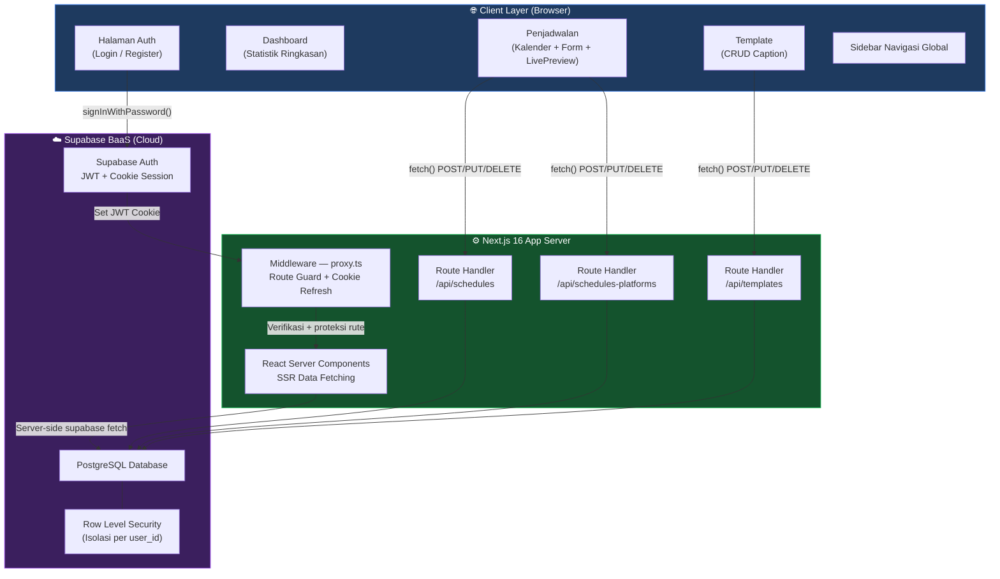
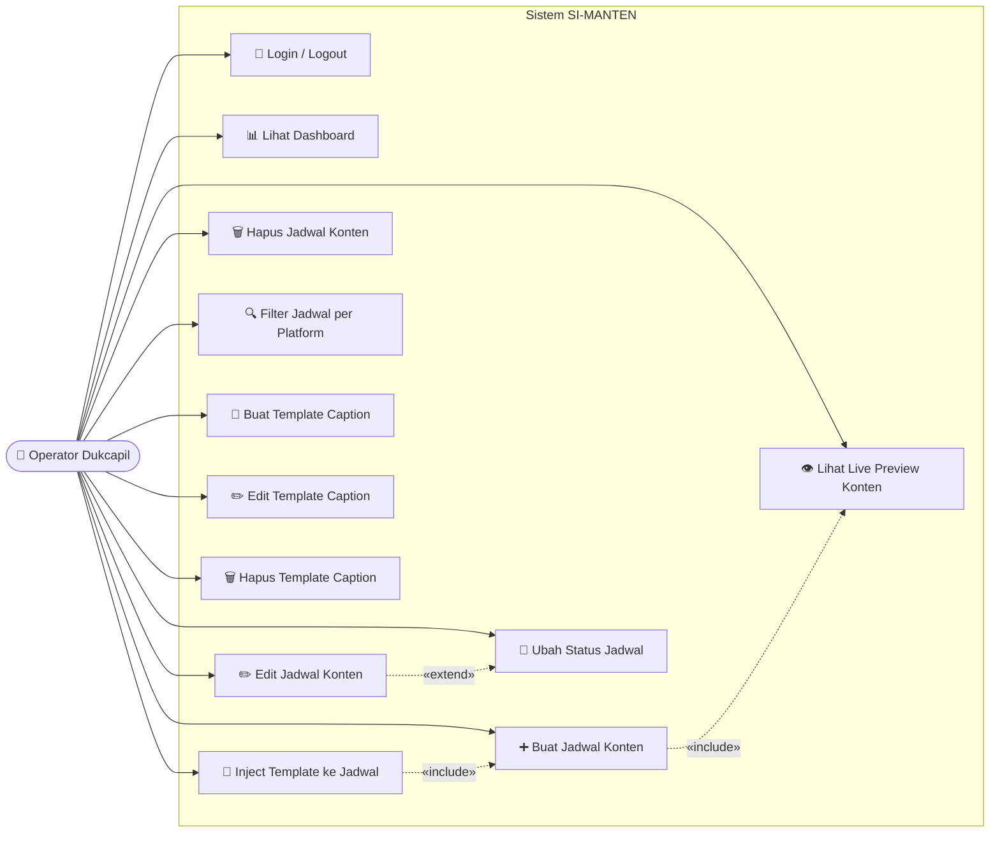
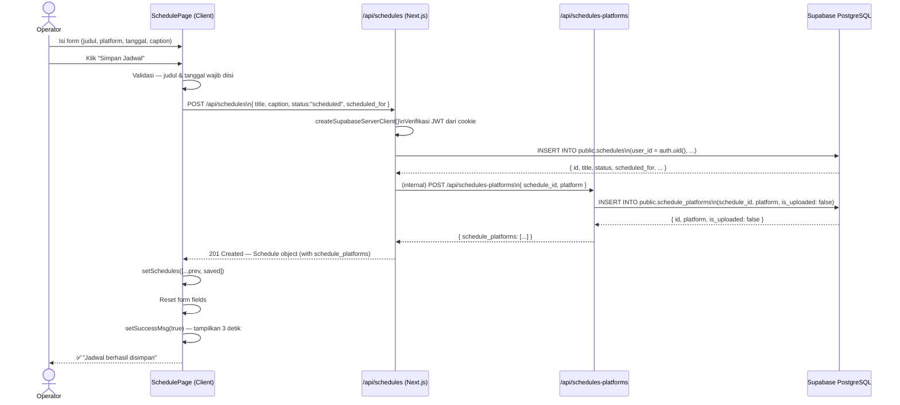
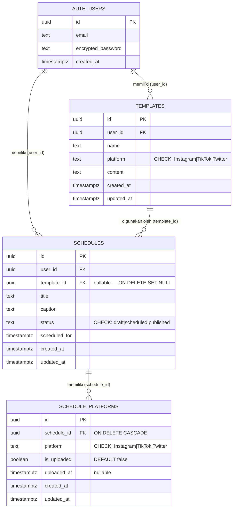
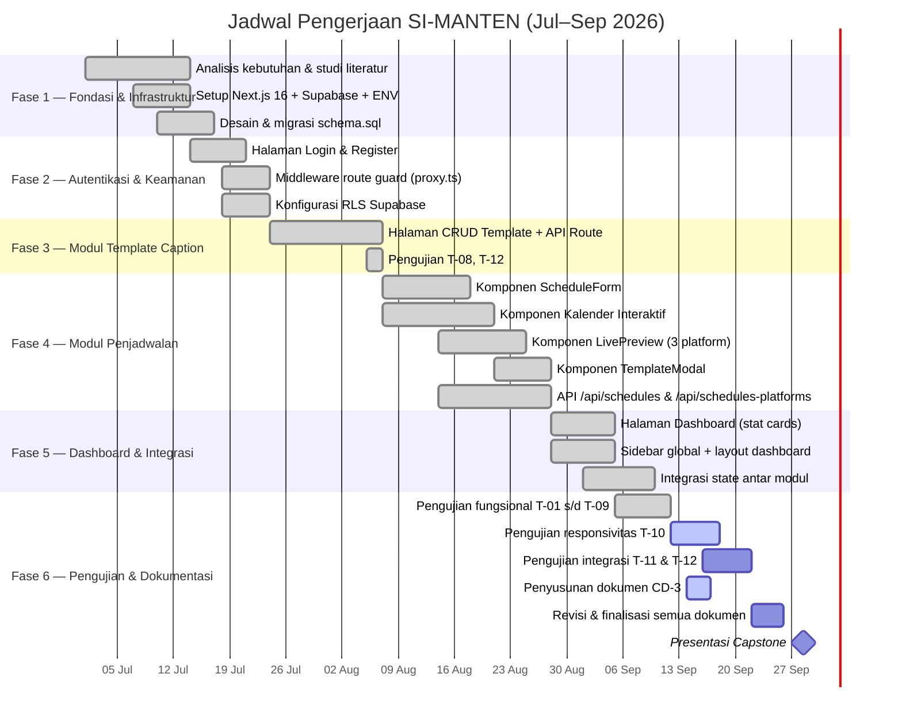

# CAPSTONE DESIGN — S1SI-CD-3
## SI-MANTEN: Sistem Informasi Manajemen Konten Media Sosial Dinas Kependudukan dan Pencatatan Sipil

| | |
|---|---|
| **Nomor Dokumen** | S1SI-CD-3 |
| **Nama Proyek** | SI-MANTEN (Sistem Informasi Manajemen Konten) |
| **Program Studi** | S1 Sistem Informasi |
| **Tanggal** | 16 September 2026 |
| **Versi** | 1.0 |

---

## Daftar Isi

1. [Pengantar](#1-pengantar)
2. [Konsep Sistem](#2-konsep-sistem)
   - 2.1 [Pilihan Konsep Sistem](#21-pilihan-konsep-sistem)
   - 2.2 [Analisis Kriteria Pemilihan (Decision Matrix)](#22-analisis-kriteria-pemilihan)
   - 2.3 [Sistem Terpilih dan Rasionalisasi](#23-sistem-terpilih-dan-rasionalisasi)
3. [Rencana Desain Sistem](#3-rencana-desain-sistem)
   - 3.1 [Top-Down Decomposition](#31-top-down-decomposition)
   - 3.2 [Diagram Blok Arsitektur](#32-diagram-blok-arsitektur)
   - 3.3 [UML — Use Case Diagram](#33-uml--use-case-diagram)
   - 3.4 [UML — Sequence Diagram (Penjadwalan Konten)](#34-uml--sequence-diagram-penjadwalan-konten)
   - 3.5 [Entity Relationship Diagram (ERD)](#35-entity-relationship-diagram-erd)
   - 3.6 [UI/UX Mockup](#36-uiux-mockup)
4. [Pengujian & Kalibrasi Sub-Modul / Komponen](#4-pengujian--kalibrasi-sub-modul--komponen)
5. [Jadwal Pengerjaan Terperinci (Gantt Chart)](#5-jadwal-pengerjaan-terperinci)
6. [Lampiran](#6-lampiran)

---

## 1. Pengantar

### 1.1 Latar Belakang

Dinas Kependudukan dan Pencatatan Sipil (Dukcapil) memiliki kebutuhan komunikasi publik yang tinggi, mencakup penyebaran informasi layanan administrasi kependudukan melalui berbagai platform media sosial seperti Instagram, TikTok, dan Twitter/X. Selama ini, pengelolaan konten dilakukan secara manual oleh operator—tidak terjadwal, tidak terintegrasi, dan tidak terdokumentasi dengan baik.

Akibatnya timbul permasalahan seperti:
- Inkonsistensi jadwal posting konten
- Duplikasi pekerjaan pembuatan caption antar platform
- Tidak adanya dokumentasi histori konten yang dipublikasikan
- Sulitnya memantau status konten (draft / terjadwal / terbit)

### 1.2 Rumusan Masalah

1. Bagaimana merancang sistem penjadwalan konten media sosial yang terpusat dan mudah digunakan oleh operator Dukcapil?
2. Bagaimana sistem dapat mendukung manajemen template caption yang reusable lintas platform?
3. Bagaimana sistem menjamin keamanan data dengan akses berbasis autentikasi pengguna?

### 1.3 Tujuan Proyek

- Membangun aplikasi web **SI-MANTEN** berbasis Next.js 16 yang memungkinkan operator Dukcapil menjadwalkan dan mengelola konten media sosial secara terpusat.
- Menyediakan fitur **manajemen template caption** yang dapat digunakan ulang untuk berbagai platform (Instagram, TikTok, Twitter).
- Mengimplementasikan **autentikasi berbasis Supabase Auth** dengan proteksi rute server-side.
- Memberikan **live preview** konten sesuai format platform yang dituju sebelum konten dijadwalkan.

### 1.4 Ruang Lingkup

| Dalam Lingkup | Di Luar Lingkup |
|---|---|
| Autentikasi pengguna (login/register) | Posting otomatis langsung ke API media sosial |
| Penjadwalan konten per platform | Analitik engagement media sosial (likes, shares) |
| Manajemen template caption | Manajemen multi-akun/multi-organisasi |
| Kalender jadwal konten interaktif | Fitur notifikasi push mobile |
| Live preview mockup per platform | Pengelolaan file media (gambar/video upload) |
| Dashboard ringkasan status konten | Integrasi AI generasi caption |

---

## 2. Konsep Sistem

### 2.1 Pilihan Konsep Sistem

Dalam proses perancangan SI-MANTEN, tim mengidentifikasi empat dimensi konseptual yang masing-masing memiliki beberapa alternatif pilihan.

#### A. Arsitektur Utama

| Kode | Konsep | Deskripsi |
|---|---|---|
| **A1** | **Monolitik Full-Stack (Next.js App Router)** | Frontend dan API Route berada dalam satu proyek Next.js. Data layer menggunakan Supabase sebagai BaaS. |
| A2 | Microservices terpisah | Frontend (React SPA) + Backend API terpisah (Express/NestJS) + Database. |
| A3 | JAMStack Static + CMS Headless | Frontend statis di-generate dari headless CMS (Contentful/Strapi) + Netlify Functions. |

#### B. Strategi Interaksi (Rendering)

| Kode | Konsep | Deskripsi |
|---|---|---|
| **B1** | **Server Components + Client Components Hybrid** | Data fetching di server (SSR/RSC), interaktivitas di client. |
| B2 | Pure Client-Side Rendering (CSR) | Semua data fetch dari browser, loading state manual. |
| B3 | Pure SSR (Server-Side Rendering) | Setiap interaksi memerlukan full page reload. |

#### C. Algoritma / Logika Penjadwalan

| Kode | Konsep | Deskripsi |
|---|---|---|
| **C1** | **Database-driven scheduling dengan status state machine** | Status konten (draft → scheduled → published) dikelola di database. Transisi status dipicu secara manual oleh operator. |
| C2 | Cron-job otomatis + queue | Server-side cron job memproses jadwal dan mengubah status secara otomatis. |
| C3 | Event-driven + webhook | Supabase Edge Functions sebagai trigger berbasis event timestamp. |

#### D. Sub-Modul Utama

| Kode | Konsep | Deskripsi |
|---|---|---|
| **D1** | **Modular component-based** | Setiap fitur (Kalender, Form, Preview, Template) merupakan komponen React independen dengan state terpusat. |
| D2 | Page-per-feature (routing berat) | Setiap fitur berada di halaman terpisah, navigasi penuh antar fitur. |

---

### 2.2 Analisis Kriteria Pemilihan

#### Decision Matrix — Arsitektur Utama

Skala penilaian: 1 (sangat buruk) — 5 (sangat baik)

| Kriteria | Bobot | A1 Monolitik Next.js | A2 Microservices | A3 JAMStack CMS |
|---|:---:|:---:|:---:|:---:|
| Kemudahan pengembangan | 25% | **5** | 3 | 3 |
| Performa & latensi | 20% | **5** | 4 | 3 |
| Skalabilitas | 15% | 4 | **5** | 3 |
| Keamanan data | 20% | **5** | 4 | 3 |
| Biaya operasional | 10% | **5** | 3 | 4 |
| Kesesuaian tim (timeline) | 10% | **5** | 2 | 3 |
| **Total Skor** | 100% | **4.80** | 3.55 | 3.10 |

> Perhitungan A1: (5×0.25)+(5×0.20)+(4×0.15)+(5×0.20)+(5×0.10)+(5×0.10) = 1.25+1.00+0.60+1.00+0.50+0.50 = **4.85**

#### Decision Matrix — Strategi Interaksi

| Kriteria | Bobot | B1 Hybrid SSR/CSR | B2 Pure CSR | B3 Pure SSR |
|---|:---:|:---:|:---:|:---:|
| Performa loading awal | 30% | **5** | 3 | 4 |
| Interaktivitas UI | 30% | **5** | **5** | 2 |
| SEO & aksesibilitas | 20% | **5** | 2 | 4 |
| Kompleksitas implementasi | 20% | 3 | **5** | 4 |
| **Total Skor** | 100% | **4.60** | 3.50 | 3.20 |

> Perhitungan B1: (5×0.30)+(5×0.30)+(5×0.20)+(3×0.20) = 1.50+1.50+1.00+0.60 = **4.60**

#### Decision Matrix — Logika Penjadwalan

| Kriteria | Bobot | C1 State Machine DB | C2 Cron-job Otomatis | C3 Edge Functions |
|---|:---:|:---:|:---:|:---:|
| Kontrol operator | 35% | **5** | 2 | 3 |
| Kemudahan implementasi | 25% | **5** | 3 | 3 |
| Keandalan sistem | 20% | 4 | 4 | **5** |
| Biaya infrastruktur | 20% | **5** | 3 | 4 |
| **Total Skor** | 100% | **4.75** | 2.80 | 3.60 |

> Perhitungan C1: (5×0.35)+(5×0.25)+(4×0.20)+(5×0.20) = 1.75+1.25+0.80+1.00 = **4.80**

---

### 2.3 Sistem Terpilih dan Rasionalisasi

Berdasarkan analisis decision matrix di atas, sistem SI-MANTEN dibangun menggunakan kombinasi:

| Dimensi | Pilihan Terpilih | Skor | Alasan |
|---|---|:---:|---|
| Arsitektur | **A1 — Monolitik Next.js 16** | 4.85 | Satu repositori, deployment mudah, tidak ada overhead inter-service. Supabase menangani auth + database + RLS secara terintegrasi. |
| Interaksi | **B1 — Hybrid SSR + CSR** | 4.60 | Data awal di-fetch di server (lebih cepat, aman), interaksi kalender & preview di client tanpa reload. |
| Penjadwalan | **C1 — Database State Machine** | 4.80 | Operator Dukcapil perlu kontrol penuh atas kapan konten berubah status. Tidak dibutuhkan eksekusi otomatis pada tahap ini. |
| Sub-Modul | **D1 — Modular Components** | — | Pemisahan concern yang jelas: Calendar, ScheduleForm, LivePreview, TemplateModal masing-masing independen dan mudah diuji. |

> **Kesimpulan Rasionalisasi**: Next.js App Router dengan Supabase sebagai BaaS adalah pilihan paling efisien dari sisi pengembangan, biaya, dan keamanan untuk konteks organisasi pemerintahan skala menengah seperti Dukcapil. Row Level Security (RLS) Supabase memastikan setiap user hanya dapat mengakses datanya sendiri tanpa logika autorisasi tambahan di lapisan aplikasi.

---

## 3. Rencana Desain Sistem

### 3.1 Top-Down Decomposition

```
SI-MANTEN
├── Modul Autentikasi
│   ├── Login (email + password via Supabase Auth)
│   ├── Register
│   └── Route Guard (Middleware proxy.ts)
│
├── Modul Dashboard
│   ├── Ringkasan statistik (total jadwal, draft, published)
│   └── Quick-access navigasi
│
├── Modul Penjadwalan Konten
│   ├── Kalender Interaktif
│   │   ├── Navigasi bulan (prev/next)
│   │   ├── Filter per platform (All / Instagram / TikTok / Twitter)
│   │   ├── Indikator jadwal per tanggal (dot berwarna per platform)
│   │   └── Panel detail tanggal terpilih (daftar jadwal + CRUD)
│   ├── Form Penjadwalan
│   │   ├── Input judul konten
│   │   ├── Selector platform
│   │   ├── DateTimePicker (tanggal & jam)
│   │   ├── Editor caption (textarea)
│   │   ├── Tombol "Gunakan Template"
│   │   └── Tombol "Simpan Jadwal"
│   └── Live Preview
│       ├── Mockup Instagram post
│       ├── Mockup TikTok post
│       └── Mockup Twitter/X post
│
├── Modul Template Caption
│   ├── Daftar template (dikelompokkan per platform)
│   ├── Buat template baru
│   ├── Edit template
│   ├── Hapus template
│   └── Inject template ke form jadwal (via TemplateModal)
│
└── Infrastruktur
    ├── API Routes (Next.js Route Handlers)
    │   ├── /api/schedules          → GET, POST, PUT, DELETE
    │   ├── /api/schedules-platforms → GET, POST, PUT, DELETE
    │   └── /api/templates          → GET, POST, PUT, DELETE
    ├── Database (Supabase PostgreSQL)
    │   ├── Tabel: auth.users (bawaan Supabase)
    │   ├── Tabel: public.templates
    │   ├── Tabel: public.schedules
    │   └── Tabel: public.schedule_platforms
    └── Auth & Keamanan
        ├── Supabase Auth (JWT via httpOnly cookie)
        ├── Row Level Security (RLS) per tabel
        └── Middleware server-side (proxy.ts)
```

---

### 3.2 Diagram Blok Arsitektur



---

### 3.3 UML — Use Case Diagram



---

### 3.4 UML — Sequence Diagram (Penjadwalan Konten)



---

### 3.5 Entity Relationship Diagram (ERD)



**Keterangan Entitas:**

| Entitas | Keterangan |
|---|---|
| `auth.users` | Tabel bawaan Supabase Auth. Menyimpan akun operator Dukcapil. |
| `public.templates` | Template caption reusable. Setiap template terikat ke satu platform. |
| `public.schedules` | Jadwal konten utama. Menyimpan judul, caption, status state-machine, dan waktu tayang. |
| `public.schedule_platforms` | Relasi many-to-one platform per jadwal, dengan flag `is_uploaded` per platform. |

**Constraints & RLS:**
- `platform` di `templates` dan `schedule_platforms`: `CHECK (platform IN ('Instagram', 'TikTok', 'Twitter'))`
- `status` di `schedules`: `CHECK (status IN ('draft', 'scheduled', 'published'))`
- Semua tabel: `ENABLE ROW LEVEL SECURITY` — user hanya bisa membaca dan memodifikasi data miliknya sendiri (`auth.uid() = user_id`)

---

### 3.6 UI/UX Mockup

> **Design System**: Dark theme (`zinc-950` base), aksen biru (`blue-600`), border `zinc-700/800`, rounded-xl corners, Tailwind CSS v4.

#### Inventaris Halaman

| Halaman | Route | Tipe Rendering | Komponen Utama |
|---|---|---|---|
| Login | `/login` | Client Component | Split-screen kiri (visual) + kanan (form) |
| Register | `/register` | Client Component | Form registrasi |
| Dashboard | `/dashboard` | Server Component + Client | Stat cards + recent schedules |
| Penjadwalan | `/schedules` | Server (data) + Client (UI) | Calendar + ScheduleForm + LivePreview + TemplateModal |
| Template | `/template` | Server (data) + Client (UI) | Daftar template + form CRUD inline |

#### Hierarki Komponen — Halaman Penjadwalan (`/schedules`)

```
app/(dashboard)/schedules/
├── page.tsx                    ← Server Component
│   └── fetch schedules + templates dari Supabase
│       └── <SchedulePage /> (Client Component)
│           │
│           ├── <Calendar />
│           │   ├── Header: NavigasiBuilan + FilterPlatform
│           │   ├── Grid 7×6: sel tanggal + dot indikator
│           │   └── Panel bawah: DaftarJadwalTanggalTerpilih
│           │
│           ├── <ScheduleForm />
│           │   ├── InputJudul
│           │   ├── SelectorPlatform (Instagram/TikTok/Twitter)
│           │   ├── DateTimePicker
│           │   ├── TextareaCaption
│           │   ├── Tombol "Gunakan Template" → buka TemplateModal
│           │   └── Tombol "Simpan Jadwal"
│           │
│           ├── <LivePreview />
│           │   ├── TabSelector (per platform)
│           │   └── MockupVisual (format post sesuai platform)
│           │
│           └── <TemplateModal /> (conditional render)
│               ├── DaftarTemplate (difilter per platform)
│               └── Tombol "Gunakan" → inject ke ScheduleForm
```

#### Palet Warna Platform

| Platform | Warna Utama | Background | Text Color |
|---|---|---|---|
| Instagram | `#185FA5` | `#E6F1FB` | `#185FA5` |
| TikTok | `#D4537E` | `#FBEAF0` | `#993556` |
| Twitter/X | `#1D9E75` | `#E1F5EE` | `#0F6E56` |

---

## 4. Pengujian & Kalibrasi Sub-Modul / Komponen

### 4.1 Strategi Pengujian

Pengujian dilakukan secara bertahap mengikuti pendekatan **bottom-up testing**: unit komponen terkecil diuji terlebih dahulu, lalu dilanjutkan uji integrasi antar modul, dan terakhir uji end-to-end.

Jenis pengujian yang digunakan:
- **Fungsional** — verifikasi alur use-case utama
- **Keamanan** — pengujian isolasi data dan proteksi rute
- **Integrasi** — verifikasi komunikasi client ↔ API ↔ Database
- **UI/Responsivitas** — verifikasi tampilan di berbagai ukuran layar

### 4.2 Matriks Pengujian Komponen

| ID | Sub-Modul / Komponen | Jenis Uji | Metode Pengujian | Kriteria Lulus (Acceptance Criteria) | Status |
|---|---|---|---|---|---|
| T-01 | Supabase Auth — Login | Fungsional | Manual + Network DevTools | Login berhasil → redirect ke `/dashboard`; kredensial salah → pesan error sesuai | ✅ Lulus |
| T-02 | Route Guard (`proxy.ts`) | Keamanan | Manual — akses URL langsung tanpa sesi aktif | Akses `/dashboard` tanpa auth → redirect `302` ke `/login?redirectTo=/dashboard` | ✅ Lulus |
| T-03 | Row Level Security (RLS) | Keamanan | Supabase SQL Editor — query lintas user | User A tidak dapat membaca/memodifikasi data User B | ✅ Lulus |
| T-04 | `ScheduleForm` — Validasi | Fungsional | Manual — submit dengan field kosong | Alert "Judul dan tanggal wajib diisi" muncul; fetch POST tidak dipanggil | ✅ Lulus |
| T-05 | `POST /api/schedules` | Integrasi | Manual + Network tab | Response `201 Created`; body berisi objek jadwal dengan `id` UUID valid | ✅ Lulus |
| T-06 | Kalender — Render Indikator | UI / Fungsional | Visual inspection setelah simpan jadwal | Dot indikator muncul pada tanggal sesuai; warna sesuai platform | ✅ Lulus |
| T-07 | `LivePreview` — Platform Switch | UI | Manual klik tab platform | Tampilan mockup berubah sesuai platform (Instagram/TikTok/Twitter) | ✅ Lulus |
| T-08 | `TemplateModal` — Inject | Integrasi | Manual — pilih template → cek form | Field judul, caption, dan platform terisi sesuai template terpilih | ✅ Lulus |
| T-09 | Filter Kalender per Platform | Fungsional | Manual toggle filter | Hanya jadwal platform terpilih tampil; filter "All" menampilkan semua | ✅ Lulus |
| T-10 | Responsivitas Layout | UI | DevTools viewport 375px (iPhone SE) | Layout tidak overflow; kalender, form, preview terbaca di layar kecil | 🔄 Dalam Proses |
| T-11 | `DELETE /api/schedules` | Integrasi | Manual + Network tab | Response `200`/`204`; jadwal hilang dari state UI dan database | 🔲 Belum Diuji |
| T-12 | Template CRUD — Edit & Delete | Fungsional | Manual via UI halaman `/template` | Perubahan tersimpan di DB; penghapusan menghilangkan template dari daftar | 🔲 Belum Diuji |

**Legenda Status:** ✅ Lulus &nbsp;|&nbsp; 🔄 Dalam Proses &nbsp;|&nbsp; 🔲 Belum Diuji &nbsp;|&nbsp; ❌ Gagal

### 4.3 Catatan Kalibrasi & Penyesuaian

| # | Komponen | Temuan / Bug | Penyesuaian yang Dilakukan |
|---|---|---|---|
| K-01 | `LivePreview` | State preview tidak sinkron saat klik jadwal di kalender; form dan preview menampilkan data berbeda | Ditambahkan state terpisah `calendarPreviewSchedule`; conditional rendering di `SchedulePage` memisahkan sumber data form vs. calendar |
| K-02 | Kalender — filter platform | Filter tidak berfungsi karena data platform ada di tabel terpisah `schedule_platforms`, bukan kolom langsung di `schedules` | Data di-join saat fetch via `select('*, schedule_platforms(*)')`; filter dilakukan di client state menggunakan `Array.filter()` |
| K-03 | Route Guard — token expired | Sesi user tiba-tiba logout karena token kadaluarsa tidak di-refresh otomatis | Middleware `proxy.ts` diperbarui: selalu memanggil `supabase.auth.getUser()` (bukan `getSession()`) untuk verifikasi + refresh token ke server Supabase |
| K-04 | `ScheduleForm` — state reset | Setelah simpan jadwal, field caption tidak ter-reset karena `setCaption('')` tidak dipanggil | Ditambahkan `setCaption('')` dan `setCalendarPreviewSchedule(null)` pada handler `handleSave` setelah berhasil simpan |

---

## 5. Jadwal Pengerjaan Terperinci

### 5.1 Gantt Chart



### 5.2 Tabel Milestone

| Milestone | Deskripsi | Tanggal Target | Status |
|---|---|---|---|
| **M1** | Infrastruktur & Auth berjalan end-to-end | 24 Juli 2026 | ✅ Selesai |
| **M2** | Modul Template Caption lengkap & teruji | 7 Agustus 2026 | ✅ Selesai |
| **M3** | Modul Penjadwalan + API Routes selesai | 28 Agustus 2026 | ✅ Selesai |
| **M4** | Integrasi penuh: Dashboard + Sidebar + State | 10 September 2026 | ✅ Selesai |
| **M5** | Semua pengujian T-01 s/d T-12 lulus | 22 September 2026 | 🔄 Dalam Proses |
| **M6** | Dokumentasi Capstone final (CD-1, CD-2, CD-3) | 26 September 2026 | 🔄 Dalam Proses |
| **M7** | **Presentasi Capstone Design** | **28 September 2026** | ⬜ Mendatang |

---

## 6. Lampiran

### Lampiran A — Stack Teknologi

| Kategori | Teknologi | Versi | Keterangan |
|---|---|---|---|
| Framework | Next.js | 16.2.6 | App Router, Server Components, Route Handlers |
| UI Library | React | 19.2.4 | Concurrent features, hooks |
| Bahasa | TypeScript | ^5 | Strict type checking |
| Styling | Tailwind CSS | ^4 | Utility-first CSS |
| BaaS | Supabase | ^2.107.0 | Auth + PostgreSQL + RLS + Realtime |
| Auth Adapter (SSR) | @supabase/ssr | ^0.10.3 | Cookie-based JWT untuk Next.js SSR |
| Icon Set | Lucide React | ^1.21.0 | Icon library tree-shakeable |
| Theme | next-themes | ^0.4.6 | Dark/light mode toggle |
| Database | PostgreSQL | via Supabase | Managed cloud PostgreSQL |
| Runtime | Node.js | ≥ 18 | Server runtime |

### Lampiran B — Struktur Direktori Proyek

```
siteks-dukcapil/                        ← Root proyek
├── app/
│   ├── (auth)/                         ← Route group: halaman auth
│   │   ├── login/page.tsx              ← Halaman login
│   │   └── register/page.tsx           ← Halaman register
│   ├── (dashboard)/                    ← Route group: halaman dashboard (protected)
│   │   ├── layout.tsx                  ← Layout dengan sidebar
│   │   ├── dashboard/page.tsx          ← Server Component — statistik dashboard
│   │   ├── schedules/
│   │   │   ├── page.tsx               ← Server Component — fetch data, render SchedulePage
│   │   │   └── SchedulePage.tsx       ← Client Component — state + interaksi
│   │   └── template/page.tsx          ← Halaman template CRUD
│   ├── api/                            ← REST API Route Handlers
│   │   ├── schedules/route.ts          ← CRUD jadwal
│   │   ├── schedules-platforms/route.ts ← CRUD platform per jadwal
│   │   └── templates/route.ts          ← CRUD template
│   ├── components/
│   │   ├── sidebar.tsx                 ← Navigasi sidebar global
│   │   ├── footer.tsx
│   │   └── schedules/
│   │       ├── calendar.tsx            ← Kalender interaktif
│   │       ├── livePreview.tsx         ← Mockup preview 3 platform
│   │       ├── scheduleForm.tsx        ← Form input jadwal
│   │       ├── templateModal.tsx       ← Modal pilih template
│   │       ├── DashboardPage.tsx       ← Komponen statistik dashboard
│   │       └── types.ts               ← TypeScript types & konstanta
│   ├── globals.css
│   ├── layout.tsx                      ← Root layout + ThemeProvider
│   └── page.tsx                        ← Landing page
├── lib/
│   ├── supabase-browser.ts             ← Supabase client (browser/CSR)
│   └── supabase-server.ts              ← Supabase client (server/SSR)
├── proxy.ts                            ← Middleware: route guard + token refresh
├── schema.sql                          ← DDL database Supabase
├── next.config.ts
├── package.json
├── tsconfig.json
└── S1SI-CD-3_Capstone_Design.md        ← Dokumen ini
```

### Lampiran C — SQL Schema Lengkap

```sql
-- ==========================================
-- SITEKS DUKCAPIL - SUPABASE DATABASE SCHEMA
-- ==========================================

-- 1. Tabel Templates
CREATE TABLE IF NOT EXISTS public.templates (
    id          UUID PRIMARY KEY DEFAULT gen_random_uuid(),
    user_id     UUID NOT NULL REFERENCES auth.users(id) ON DELETE CASCADE,
    name        TEXT NOT NULL,
    platform    TEXT NOT NULL CHECK (platform IN ('Instagram', 'TikTok', 'Twitter')),
    content     TEXT NOT NULL,
    created_at  TIMESTAMPTZ NOT NULL DEFAULT now(),
    updated_at  TIMESTAMPTZ NOT NULL DEFAULT now()
);

-- 2. Tabel Schedules
CREATE TABLE IF NOT EXISTS public.schedules (
    id            UUID PRIMARY KEY DEFAULT gen_random_uuid(),
    user_id       UUID NOT NULL REFERENCES auth.users(id) ON DELETE CASCADE,
    template_id   UUID REFERENCES public.templates(id) ON DELETE SET NULL,
    title         TEXT NOT NULL,
    caption       TEXT NOT NULL DEFAULT '',
    status        TEXT NOT NULL DEFAULT 'scheduled'
                  CHECK (status IN ('draft', 'scheduled', 'published')),
    scheduled_for TIMESTAMPTZ NOT NULL,
    created_at    TIMESTAMPTZ NOT NULL DEFAULT now(),
    updated_at    TIMESTAMPTZ NOT NULL DEFAULT now()
);

-- 3. Tabel Schedule Platforms
CREATE TABLE IF NOT EXISTS public.schedule_platforms (
    id          UUID PRIMARY KEY DEFAULT gen_random_uuid(),
    schedule_id UUID NOT NULL REFERENCES public.schedules(id) ON DELETE CASCADE,
    platform    TEXT NOT NULL CHECK (platform IN ('Instagram', 'TikTok', 'Twitter')),
    is_uploaded BOOLEAN NOT NULL DEFAULT false,
    uploaded_at TIMESTAMPTZ DEFAULT NULL,
    created_at  TIMESTAMPTZ NOT NULL DEFAULT now(),
    updated_at  TIMESTAMPTZ NOT NULL DEFAULT now()
);

-- ==========================================
-- ROW LEVEL SECURITY (RLS)
-- ==========================================

ALTER TABLE public.templates          ENABLE ROW LEVEL SECURITY;
ALTER TABLE public.schedules          ENABLE ROW LEVEL SECURITY;
ALTER TABLE public.schedule_platforms ENABLE ROW LEVEL SECURITY;

-- Policy: templates
CREATE POLICY "Users can manage their own templates"
    ON public.templates FOR ALL TO authenticated
    USING (auth.uid() = user_id)
    WITH CHECK (auth.uid() = user_id);

-- Policy: schedules
CREATE POLICY "Users can manage their own schedules"
    ON public.schedules FOR ALL TO authenticated
    USING (auth.uid() = user_id)
    WITH CHECK (auth.uid() = user_id);

-- Policy: schedule_platforms (akses via relasi ke schedules)
CREATE POLICY "Users can manage their own schedule platforms"
    ON public.schedule_platforms FOR ALL TO authenticated
    USING (
        EXISTS (
            SELECT 1 FROM public.schedules
            WHERE schedules.id = schedule_platforms.schedule_id
            AND schedules.user_id = auth.uid()
        )
    )
    WITH CHECK (
        EXISTS (
            SELECT 1 FROM public.schedules
            WHERE schedules.id = schedule_platforms.schedule_id
            AND schedules.user_id = auth.uid()
        )
    );
```

### Lampiran D — Alur Autentikasi & Route Protection

```mermaid
flowchart TD
    A([Operator membuka URL]) --> B{Cookie JWT valid?}
    B -- Tidak / Expired --> C{Rute protected?\n/dashboard, /template, /schedules}
    C -- Ya --> D["Redirect 302 ke\n/login?redirectTo={pathname}"]
    C -- Tidak --> E[Render halaman publik]
    B -- Ya --> F{Akses /login?}
    F -- Ya --> G[Redirect ke /dashboard]
    F -- Tidak --> H[supabase.auth.getUser()\nVerifikasi token ke Supabase server]
    H -- Token valid --> I[Render halaman + refresh cookie]
    H -- Token invalid --> D
    D --> J[Operator isi form login]
    J --> K[supabase.auth.signInWithPassword]
    K -- Error --> L[Tampilkan pesan error spesifik]
    K -- Berhasil --> M[Supabase set JWT httpOnly cookie]
    M --> N[router.push ke redirectTo atau /dashboard]
    N --> I
```

---

*Dokumen ini disusun sebagai bagian dari Capstone Design S1 Sistem Informasi.*  
*Nomor Dokumen: **S1SI-CD-3** | Versi: **1.0** | Tanggal: **16 September 2026***
